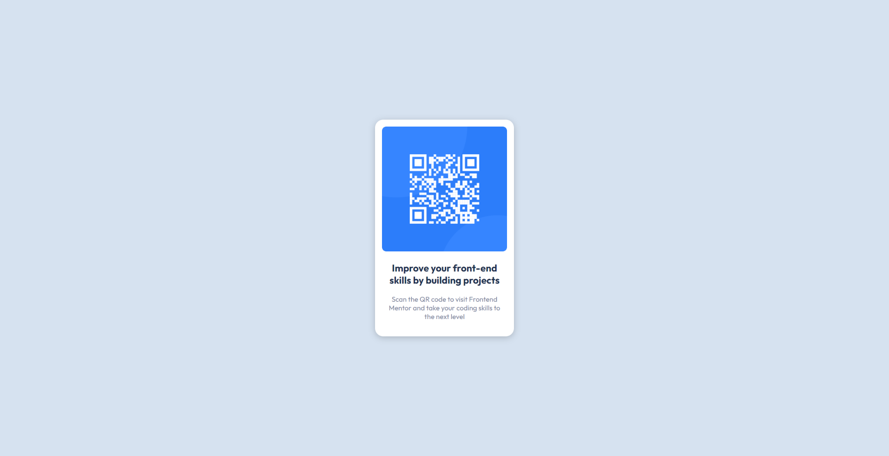

## Table of contents

- [Overview](#overview)
  - [01](#01)
    - [Overview](#overview)
    - [Screenshot](#screenshot)
    - [What I learned](#what-i-learned)

## Overview
This repository will act as a portfolio for all of the challenges that I have done on Front End Mentor.

### 01 

### Overview

[QR code component challenge on Frontend Mentor](https://www.frontendmentor.io/challenges/qr-code-component-iux_sIO_H)

For the first project, basically we were supposed to recreate a QR code page. This was a beginner challenge, and allowed me to make use of my newly learnt skills to built a real "website"

For this project, I built it with these:

- Semantic HTML5 Markup
- CSS custom properties
- Flexbox

### Screenshot

### What I learned

For this project, I was looking to make use of my knowledge that I learnt and apply it to a basic project, and this was what I came up with.

1. I realized when I started was that I tried to make it 2 divs (img and text) when it should have just been one. I think that's something I need to relearn/have more practice in. 
2. One more thing I need to remember is how to import fonts into the project using links. I realized it was simply going to the font url, and then copy + pasting it instead of just pasting the master link.
